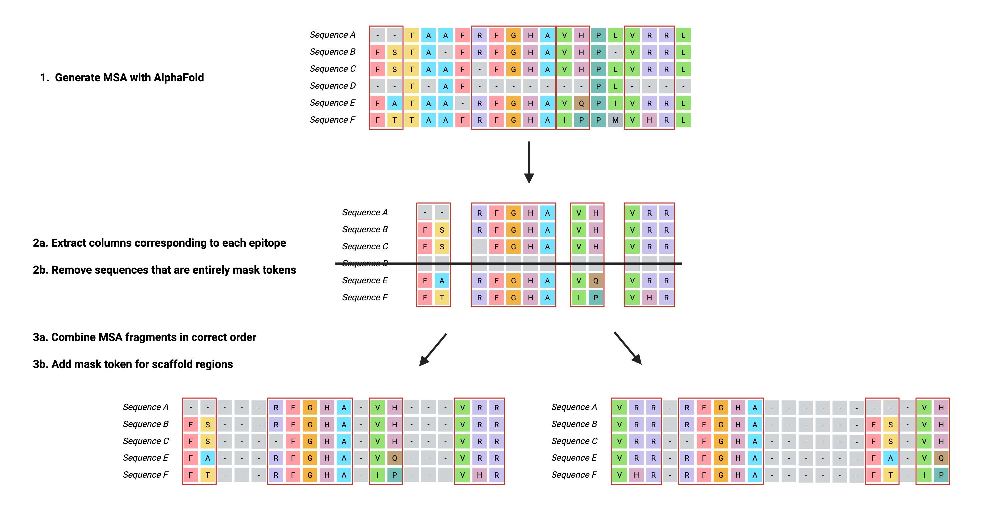
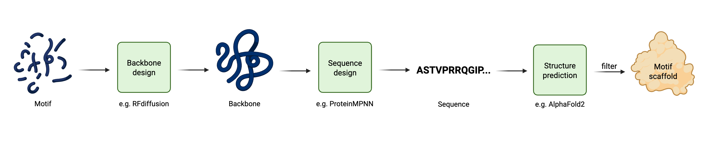
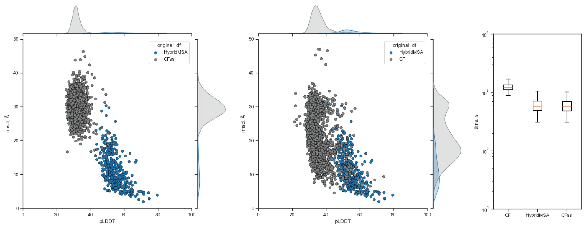

# HybridMSA

## About HybridMSA
HybridMSA is a versatile C++ tool for generating customized multiple sequence alignments (MSAs) for proteins — especially those produced via deep learning-driven motif scaffolding pipelines, though it supports a range of other use cases including fusion/chimeric proteins, tagged proteins, and more.

HybridMSA processes MSAs (e.g., from AlphaFold2, ColabFold, or other sources) and generates hybrid MSAs that:

- Retain evolutionary information where available

- Insert masked tokens where needed

- Support downstream protein structure prediction (e.g., using ColabFold's AlphaFold2 implementation)

This enables structure prediction for synthetic proteins that would otherwise be unsupported or poorly modeled by default AlphaFold2 settings.

## Why use HybridMSA?

Standard MSA tools and AlphaFold2 pipelines often fail or perform poorly when:

- A protein includes de novo designed regions,

- The protein is a chimera or fusion,

- Tags (e.g., purification tags) are added,

- Genetic searches return no meaningful hits.

HybridMSA solves this by seperating genetic searching and MSA generation, enabling the combination of meaningful evolutionary content with masked regions such that the accuracy of AlphaFold2 incerases tremendously.

## Benchmarking HybridMSA

In a benchmarking case of 1000 motif scaffolds generated via the aforementioned pipeline, HybridMSA outperformed ColabFold's implementation of AlphaFold2 under default settings (CF) and under single-sequence mode (CFss) with regard to accuracy and confidence of predicted models. In a benchmarking case of 1000 motif scaffolds generated via the aforementioned pipeline, HybridMSA outperformed ColabFold's implementation of AlphaFold2 under default settings (CF) and under single-sequence mode (CFss) with regard to accuracy and confidence of predicted models. We attribute this to HybridMSA’s ability to preserve evolutionary context while avoiding  noisy or misleading genetic searches for artificial regions.

In addition, HybridMSA that enables the bypassing of time-consuming genetic and structural database searches, decreasing structure predicton time significantly compared to CF.

## Installation

// download https://github.com/soedinglab/hh-suite/blob/master/scripts/reformat.pl

// compilation
g++ -std=c++17 src/parse_msa_bfd_only.cpp -o parse_msa_bfd_only
g++ -std=c++17 src/prepare_msa_A.cpp -o prepare_msa_A -lstdc++fs
g++ -std=c++17 src/prepare_msa_B.cpp -o prepare_msa_B

## Usage

parse_msa_bfd_only
prepare_msa_A
prepare_msa_B

// syntax
./parse_msa_bfd_only /path/to/msas/directory contig1 [contig2] ...
./prepare_msa_A input_file.fasta /path/to/output/of/run_divide_msa_bfd_only/directory contig1 [contig2] ...
./prepare_msa_B input_file.fasta fasta_file a3m_file cardinality

## Citation

Described in recent publication
Please cite!